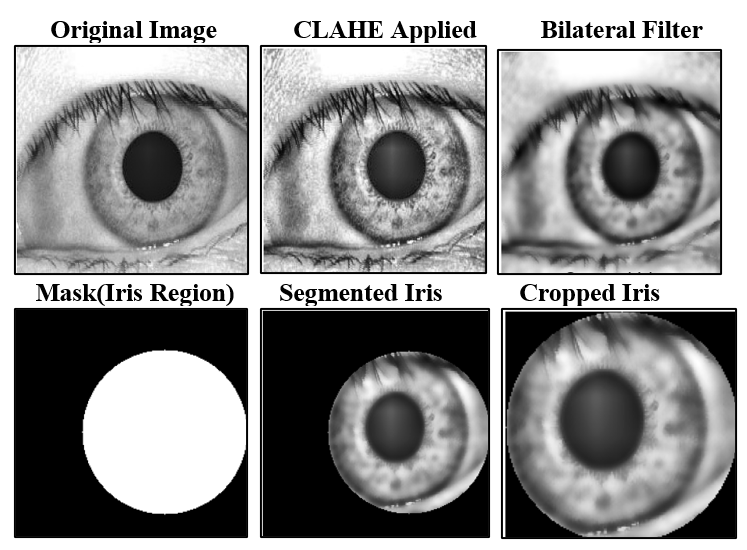
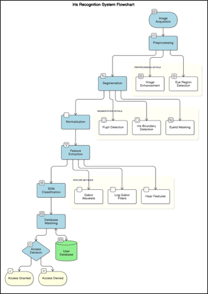

# 🧿 Iris-Based Biometric Authentication System

A modular and research-driven Iris Recognition system built using Machine Learning and Deep Learning techniques for secure biometric authentication.

This project evaluates classical ML models and lightweight CNN architectures on MMU and CASIA iris datasets, providing performance benchmarking and real-time authentication capability.

---

## 📌 Overview

Traditional authentication systems like passwords and PINs are vulnerable to breaches.  
This system leverages the uniqueness of human iris patterns to provide:

- 🔐 Secure authentication
- 👁️ Contactless identity verification
- 📊 Model benchmarking (ML vs DL)
- 🚀 Real-time inference capability

---

## 🧠 System Pipeline

The system follows a modular biometric pipeline:

1️⃣ Image Acquisition  
2️⃣ Preprocessing  
3️⃣ Iris Segmentation  
4️⃣ Feature Extraction  
5️⃣ Classification  
6️⃣ Secure Template Matching  

---

## 🔍 Preprocessing Visualization



Techniques Used:

- CLAHE (Contrast Enhancement)
- Bilateral Filtering
- Iris Masking
- Segmentation
- Normalization

---

## 🏛️ System Flowchart



---

## 👁️ Iris Recognition Output


---

## 📊 Model Performance (MMU Dataset)

| Model | Accuracy | F1 Score |
|--------|----------|----------|
| CNN | 52.22% | 49.74% |
| VGG16 | 4.44% | 1.52% |
| MobileNetV2 | 52.44% | 45.30% |
| EfficientNetB0 | 57.89% | 47.44% |
| 🏆 SVM | **81.11%** | **77.23%** |
| Random Forest | 63.33% | 60.60% |
| XGBoost | 45.56% | 42.29% |
| KNN | 43.33% | 41.04% |

### 🔥 Best Performing Model:
**Support Vector Machine (SVM)**

---

## 🚀 Deep Learning Implementation

MobileNetV2 Configuration:

- Transfer Learning (ImageNet Pretrained)
- Input Size: 224x224 RGB
- Optimizer: Adam
- Learning Rate: 0.0005
- Epochs: 15
- Loss Function: Cross Entropy

Final Accuracy Achieved: **92.76%**

---

## 🔐 Security Features

- Encrypted Template Storage
- Threshold-based Matching
- Modular Architecture
- Secure Authentication Decision System

---

## 💻 How To Run

### 1️⃣ Clone Repository

```bash
git clone https://github.com/gopi-c-k/Iris-Based-Biometric-Authentication-System
cd Iris-Project
```

2️⃣ Install Dependencies
For CASIA Dataset:
```bash
cd CASIA_Dataset
pip install -r requirements.txt
```
For MMU Dataset:

```bash
cd MMU_Iris_Dataset
pip install -r requirements.txt
```

3️⃣ Run Application

```bash
python app.py
```

📁 Dataset Used

MMU Iris Dataset
CASIA Iris Dataset

📄 Research Paper
The complete research paper is here:


